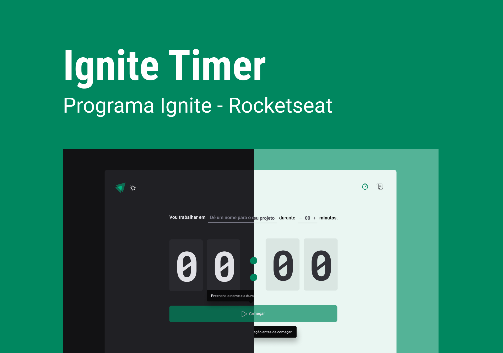
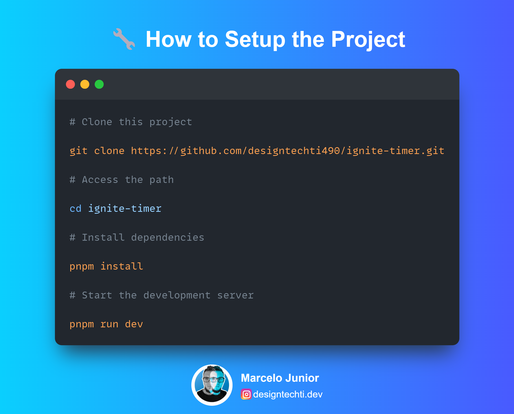
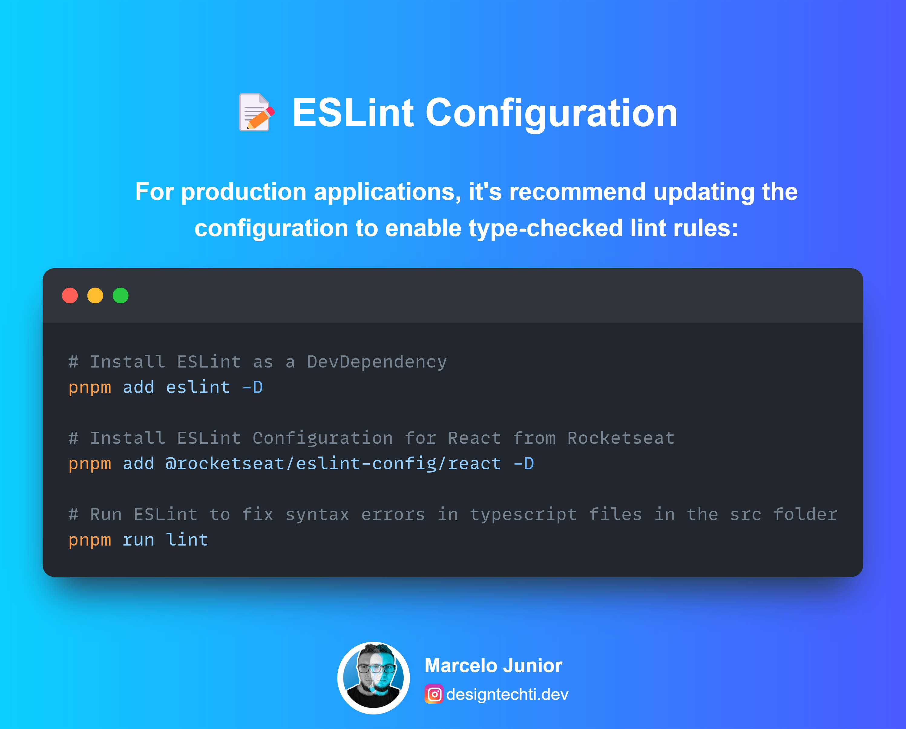
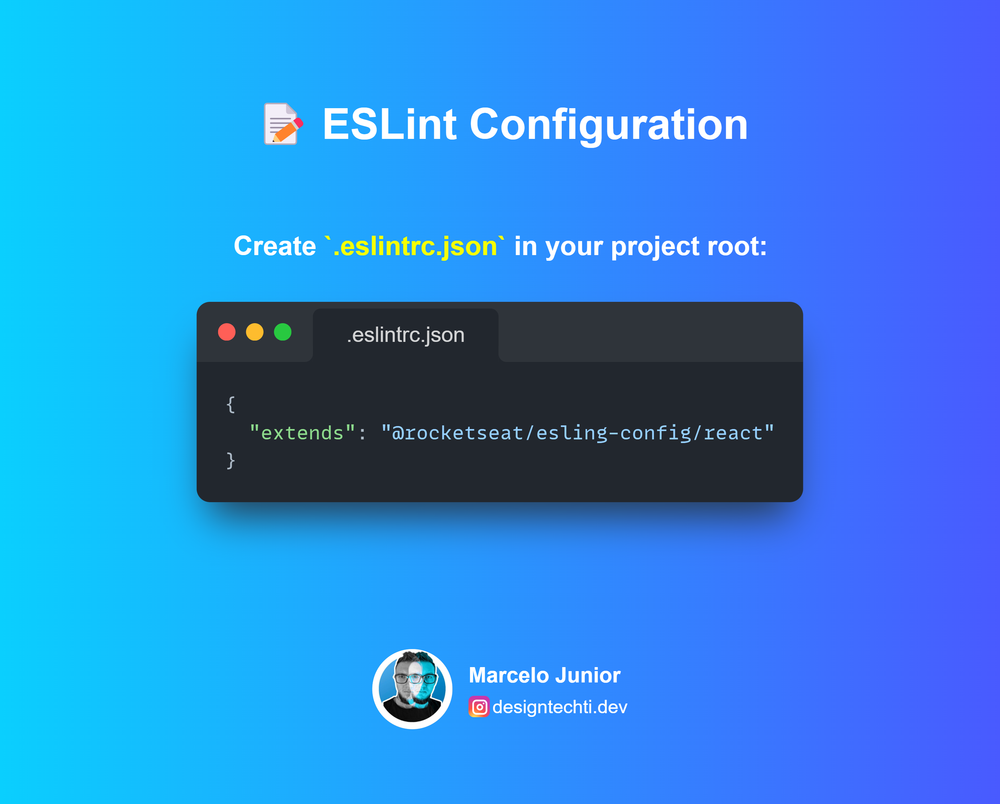

# ⏳Ignite Timer - Pomodoro 🍅

## 🚀 About this Project

Ignite Timer is a Pomodoro technique app built with React, TypeScript, and Vite. This tool helps you manage your time efficiently by alternating periods of intense focus with regular breaks. Made during Ignite Bootcamp on "Creating SPAs with ReactJS" module.

## 📱 Features

- ⏱️ Configurable Pomodoro Timer
- 📊 Session history
- 🎯 Task definition
- 🔄 Customizable cycles
- 🎨Dark and Light Themes

## 🎨 Figma Layout

You can view its layout throughth [this link](https://www.figma.com/community/file/1127351821076435124/ignite-timer).

## ⚡ Technologies Envolved

- [React](https://react.dev/learn)
- [TypeScript](https://typescryptlang.org)
- [Vite](https://vitejs.dev)
- [Styled Components](https://www.npmjs.com/package/styled-components)
- [ESLint](https://github.com/Rocketseat/eslint-config-rocketseat/blob/main/react.js)
- [React Hook Form](https://react-hook-form.com/)
- [Zod](https://zod.dev/)
- [Vitest](https://vitest.dev/)

## 🔧 Setup

## 📝 ESLint Configuration

## 🤝 Contributing

Contributions are always welcome! Here's how you can contribute:

1. Fork the project
2. Create a Branch for your Feature (`git checkout -b feature/AmazingFeature`)
3. Add your changes (`git add .`)
4. Commit your changes (`git commit -m 'Add some AmazingFeature'`)
5. Push to the Branch (`git push origin feature/AmazingFeature`)
6. Open a Pull Request

## 📄 License

This project is licensed under the MIT License. See the LICENSE file for more details.

## 👨‍💻 Author

<table width="100%">

<tr>

<td align="center">

<a href="https://github.com/designtechti490">

 

<b>Marcelo Junior</b>
          <i>Front End Developer</i>

</a>

</td>

</tr>

</table>

---

 Developed with 💜 during Rocketseat's Ignite bootcamp 

